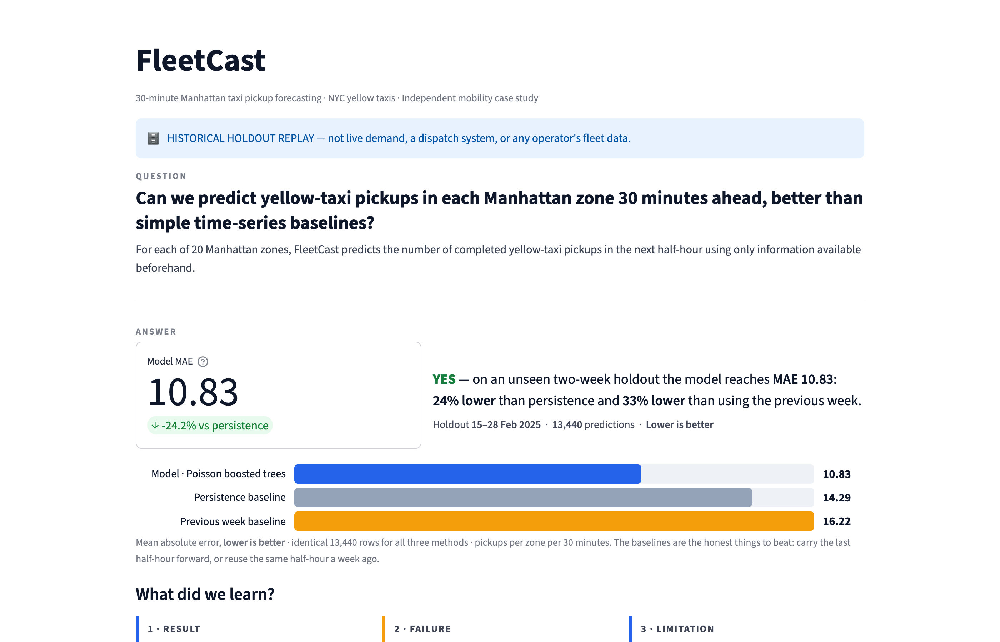

# FleetCast
## 30-minute pickup forecasting for a mobility data-science case study

**Status: real-data result, verified end to end on 15 September 2026.**
Measured on the chronological holdout (15-28 Feb 2025, 13,440 predictions): the
Poisson gradient-boosted tree reaches **MAE 10.83** against **14.29** for persistence
and **16.22** for weekly-naive - a 24% MAE reduction over the stronger test baseline.
Full verification log in `docs/TEST_STATUS.md`; evidence in `artifacts/first-run/`.
The pipeline reproduces bit-for-bit from the live TLC source. No synthetic figures.

An independent portfolio project on fleet demand forecasting, built entirely on
public NYC TLC data. No employer data, proprietary models or commissioned work.



*The Streamlit dashboard, run locally from the committed `artifacts/first-run/` files: real NYC TLC holdout results (15-28 Feb 2025), not synthetic data.*

## System architecture



*Purple: model call · blue: deterministic code · green: human · amber: evaluation · grey: storage · dashed: external, optional, mocked or planned*

`python -m fleetcast prepare` downloads the two monthly TLC Parquet files and the zone lookup, hashes them and aggregates pickups into a 20-zone, 30-minute panel with DuckDB. `python -m fleetcast run` checks the panel hash, builds past-only features, fits the Poisson gradient-boosted trees and scores them against persistence and previous-week baselines, writing predictions and metrics to `artifacts/first-run/`. The dashboard only reads those committed files: it does not download data, train or run the model.

## How AI is used

- **Model:** one learned model, scikit-learn `HistGradientBoostingRegressor` with Poisson loss and a fixed recipe (120 iterations, 15 leaves, learning rate 0.08, L2 1.0, seed 42). No LLM, API key or external inference service is involved.
- **Inputs:** ten features per zone and half-hour: lags of 1, 2, 48 and 336 bins, shifted rolling means over 4 and 48 bins, time slot, day of week, weekend flag and categorical zone.
- **Output:** a non-negative pickup count for the next 30 minutes, saved to `predictions.csv.gz` beside both baselines. It is a forecast, not a relocation or dispatch decision.
- **Deterministic and human parts:** download, hashing, SQL aggregation, features, baselines, metrics and the dashboard are plain code; the viewer only chooses which zone, day and time to replay.
- **Evaluation:** fitted on 8-31 Jan, selected on validation MAE (1-14 Feb), refitted on all pre-test data and scored once on the 15-28 Feb holdout (see [The experiment](#the-experiment)); `pytest` covers leakage, metrics and the dashboard.
- **Limitations:** the model runs only inside `fleetcast run`, never live; it overpredicts on the holdout (bias +1.96) and assumes zero data latency (see [What must not be inferred](#what-must-not-be-inferred)).

### The question
At the start of each half-hour, how many **observed yellow-taxi pickups** will
occur in each selected NYC zone during the next half-hour? Does a small learned
model improve on persistence and a weekly seasonal baseline out of sample?

Forecasting comes first. This version does **not** implement vehicle relocation,
reinforcement learning, dispatch, a digital twin, live ingestion or revenue modelling.

### Quick demo — use the saved result

```bash
cd fleetcast
./demo.sh
```

`demo.sh` checks the environment and the six frozen artifact files, frees port 8599,
starts the dashboard and opens the browser once `/healthz` returns 200. If anything
is missing it prints the recovery command and a fallback instead of starting a
half-working demo. Stop with Ctrl-C. Equivalent manual command:

```bash
.venv/bin/streamlit run app.py --server.address 127.0.0.1 --server.port 8599 --server.headless true --browser.gatherUsageStats false
```

No sync, download, preparation or training is needed. Follow `docs/DEMO_CARD.md` for
the one-screen click path and `docs/WALKTHROUGH.md` for the full walkthrough.
The dashboard reads the frozen first-run artifacts; diagnosis has exposed this holdout.
`.streamlit/config.toml` only sets presentation options (theme, minimal toolbar).

### Original setup / reproduction (not the quick-demo path)
Open Terminal in this folder. `uv` must be installed/on PATH.

```bash
uv sync
uv run pytest -q
uv run python -m fleetcast prepare
uv run python -m fleetcast run
uv run streamlit run app.py
```

`uv sync` creates a project-local environment and a lockfile. Keep the generated
`uv.lock` with the project after the successful Mac run. Python 3.12 is requested
by `.python-version`. Nothing requires an API key, paid cloud service, Docker or
GPU. The code downloads two monthly public Parquet files plus a small zone lookup.
The downloader limits each file to 250 MB, fails on incomplete files and caches
successful downloads; actual file sizes are written to the provenance manifest.

The first benchmark is written to `artifacts/first-run/`. Existing nonempty
benchmark folders are preserved. A reproducibility run can use:

```bash
uv run python -m fleetcast run --output artifacts/reproduction
```

Reproduction is not a fresh holdout. Do not change the model after viewing test
scores and still describe that test as untouched.

Agent workflow instructions: see [CONTRIBUTING.md](CONTRIBUTING.md).

### What is implemented
- Official-source download with byte counts and SHA-256 hashes; DuckDB SQL aggregation.
- Top 20 Manhattan zones selected from January only; a complete 30-minute panel.
- Past-only, within-zone lags and shifted rolling features; calendar and categorical zone features.
- Persistence, previous-week same-half-hour and a fixed Poisson gradient-boosted tree model.
- Chronological validation and one-step-ahead held-out replay; automatic score reports.
- A read-only, one-page Streamlit dashboard, including an honest empty-data state.

### The experiment

| Stage | Target timestamps, NYC local time |
|---|---|
| Raw history / zone selection | 1–31 January 2025 |
| Training after lag warmup | 8–31 January 2025 |
| Validation / model choice | 1–14 February 2025 |
| Final holdout | 15–28 February 2025 |

For a forecast at `t`, the label is pickups in `[t, t+30 minutes)`. Features use
bins ending at or before `t`: previous half-hour, previous hour, previous day,
previous week and shifted rolling means. All zones at a given timestamp belong
to the same split. The learned model has no random internal early-stopping split.
After validation, its fixed recipe is refitted on all pre-test data. During the
holdout, model weights remain fixed while earlier observed test bins become
available as history at later forecast origins. This is rolling one-step-ahead
evaluation, **not** a simultaneous prediction of the entire next fortnight.

Report MAE and RMSE in pickups per zone/half-hour, WAPE as a ratio, and signed bias
(predicted minus observed). WAPE is undefined when the observed total is zero;
the code returns `null`, not an invented percentage. Compare the same rows for all
methods, and inspect zone/day errors rather than only aggregate scores.

### What must not be inferred
Completed trips are not total demand: rejected, abandoned and unserved requests
are missing. Existing supply, vehicle availability, repositioning costs, trip
revenue and policy counterfactuals are not modelled. Lower forecast error does
not demonstrate shorter passenger waits or higher earnings. NYC winter yellow
taxis are not validated London ride-hailing data.

The public data is retrospective. Treating the preceding pickup bin as available
at every origin is a **zero-ingestion-latency assumption**, not a fact established
by this dataset. Real deployment needs as-of telemetry and a delay sensitivity
study. Missing zone bins are interpreted as zero only after citywide coverage
checks, but these checks cannot prove that the vendor records are complete.
Jan–Feb avoids a DST transition; do not extend the date range without revisiting
timestamp handling. Do not deduplicate solely on pickup time and zone: legitimate
trips can coincide and there is no unique trip ID in this reduced view.

### Outputs after a successful real run
`REPORT.md`, `metrics.json`, `metadata.json`, `predictions.csv.gz`, `zones.csv`,
`by_zone.csv` and `by_day.csv` are created inside the chosen artifacts directory.
No fitted pickle is needed: the small fixed recipe is reproducible from code.

### Sources
Sources checked 13 September 2026. `docs/BRIEF.md` records the scope decisions and
`docs/WALKTHROUGH.md` explains the method end to end.

- Official TLC trip files, lookup and data dictionaries: https://www.nyc.gov/site/tlc/about/tlc-trip-record-data.page
- scikit-learn time-series example: https://scikit-learn.org/stable/auto_examples/applications/plot_time_series_lagged_features.html
- Poisson gradient boosting API: https://scikit-learn.org/stable/modules/generated/sklearn.ensemble.HistGradientBoostingRegressor.html
- uv project workflow: https://docs.astral.sh/uv/guides/projects/

All three source files were downloaded and hashed on 15 September 2026; the byte
counts and SHA-256 digests in `artifacts/first-run/metadata.json` were re-confirmed
against a fresh download on that date, and the derived panel hash matched exactly.
NYC data remains subject to its publisher's terms; do not upload raw records or
vendor downloads by default.
